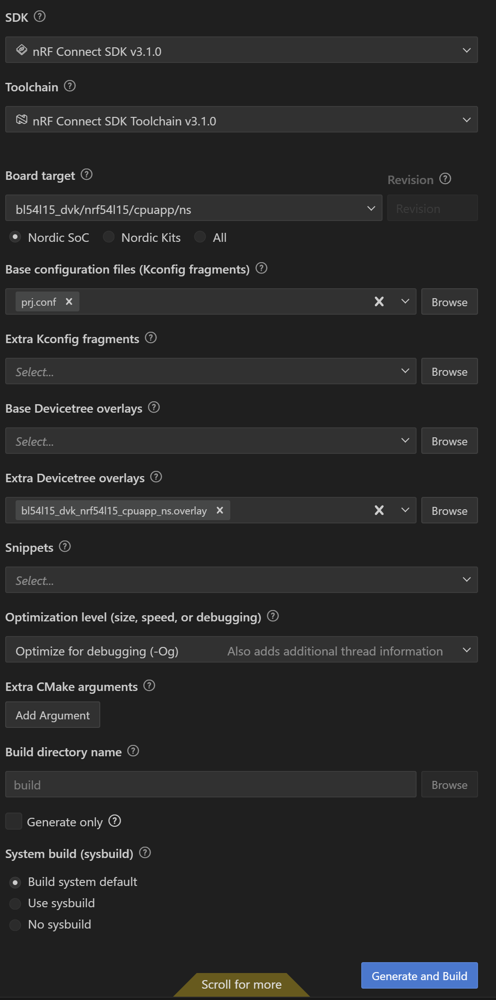
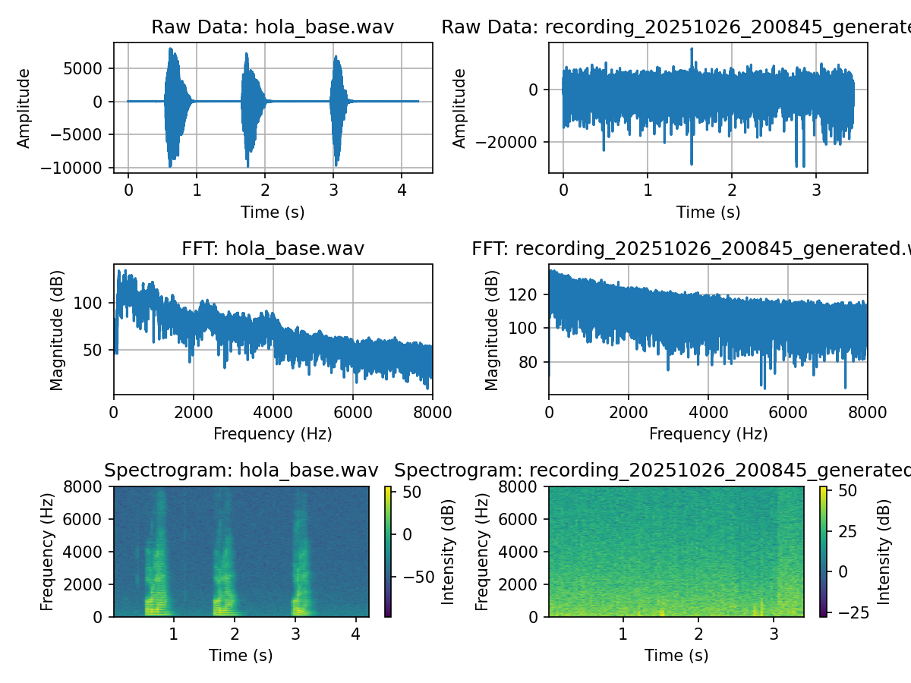

# RAISE MIC

Sending audio with microphone from nrf54l15-dk and custom board to computer via bluetooth. Goal is to measure noise reduction.

## Build Configuration

  

- .overlay is to make sure the advanced configurations of the saadc are enabled in custom boards (check saadc advanced config tutorial).

## Current results

  

